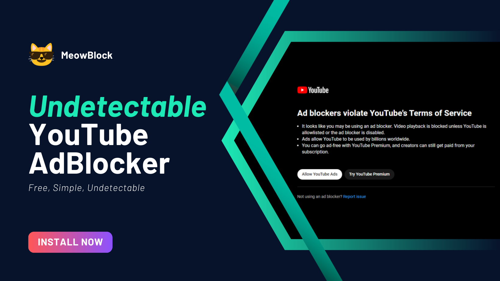

## Introduction

"MeowBlock" is designed to enhance your YouTube experience by seamlessly blocking those pesky and often intrusive advertisements that interrupt your favorite videos. Developed using simple JavaScript, this extension works diligently in the background to ensure that you can enjoy uninterrupted content without any distractions while keeping undetectable by YouTube.

 (Coming Soon!)

## Disclaimer

This extension is designed for educational use. It's important to note that the extension ensures user privacy as it neither collects nor stores any personal information from browsing activities. However, users should be aware that the extension is provided "as-is," without any warranties or guarantees, and the developers do not assume responsibility for any disruptions, damages, or losses that may occur while using it.
